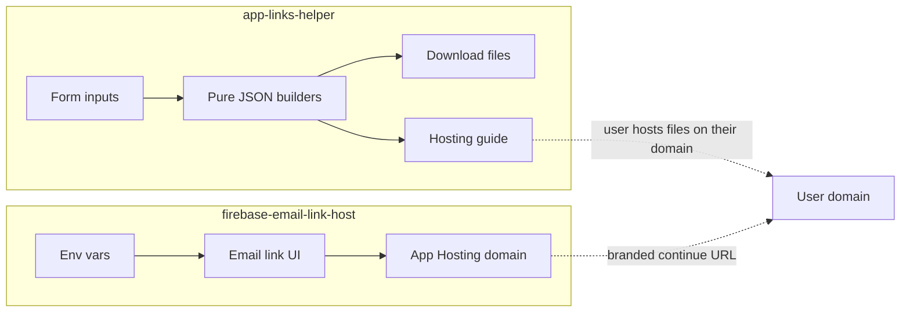

# Two-repo App Links + Email Link Auth

## Split

| Repo                           | Path                          | Deploy                       | Job                                                                                                                       |
| ------------------------------ | ----------------------------- | ---------------------------- | ------------------------------------------------------------------------------------------------------------------------- |
| **Generator** (this workspace) | [`app-links-helper`](.)       | GitHub Pages (static `out/`) | Collect Android/iOS inputs → generate `assetlinks.json` + `apple-app-site-association` → download + minimal hosting guide |
| **Auth host** (new)            | `../firebase-email-link-host` | Firebase App Hosting         | Open-source branded continue URL for Firebase email-link login; config via env vars only                                  |

No shared monorepo, no cross-repo runtime dependency. READMEs will cross-link conceptually only.



---

## Repo 1: `app-links-helper` (this workspace)

### Deploy model

- Set `output: 'export'` in [`next.config.ts`](next.config.ts) for static export.
- Add `basePath` / `assetPrefix` for GitHub project pages (e.g. `/app-links-helper`) via env so local `next dev` stays root-relative.
- GitHub Actions workflow: `bun install` → `bun run build` → upload `out/` to `gh-pages` (or `actions/deploy-pages`).

### Product UI (single page composition)

Client-side form sections:

**Android (Digital Asset Links)**

- Package name
- SHA-256 cert fingerprint(s) (multi-value)
- Optional: `namespace` default `android_app`; relation default `delegate_permission/common.handle_all_urls`

**iOS (Universal Links)**

- Team ID + Bundle ID → `appID` as `TEAMID.bundle.id`
- Path patterns (default `["*"]`)
- Optional: `webcredentials` apps list

**Actions**

- Live preview of both JSON payloads
- Download `assetlinks.json` and `apple-app-site-association` (no extension for AASA)
- Copy-to-clipboard

### Generation logic (pure, testable)

- `lib/generate-assetlinks.ts` — builds Digital Asset Links array
- `lib/generate-aasa.ts` — builds AASA (`applinks` + optional `webcredentials`)
- No third-party SDKs; no server routes (static export constraint)

### Minimal hosting guide (same page, below the form)

Short checklist only — not a full docs site:

| File    | Path                                      | Status | Content-Type       | Notes                                    |
| ------- | ----------------------------------------- | ------ | ------------------ | ---------------------------------------- |
| Android | `/.well-known/assetlinks.json`            | `200`  | `application/json` | HTTPS; no redirect; no auth              |
| iOS     | `/.well-known/apple-app-site-association` | `200`  | `application/json` | No `.json` extension; HTTPS; no redirect |

Also note root `/apple-app-site-association` as a fallback some setups still check.

### Out of scope for v1

- Pushing files into the user’s Firebase/Cloudflare account
- Validation against live domains
- Serving verification files from this Pages site for third-party apps

### README

Replace stock create-next-app README with product purpose, local run (`bun dev`), and GitHub Pages deploy steps.

---

## Repo 2: `firebase-email-link-host` (new sibling)

Scaffold a fresh Next.js + Bun app at `/Users/rutvik/Documents/Projects/Private/NextJS/firebase-email-link-host` (separate `git init`, not nested in this repo).

### Purpose

Reference app anyone can fork/deploy to Firebase App Hosting so Firebase Auth **email link** sign-in uses a **branded continue URL** on their App Hosting custom domain (instead of the default `*.firebaseapp.com` handler).

### Auth flow

1. Enter email → `sendSignInLinkToEmail` with `ActionCodeSettings.url` = `${origin}/auth/complete` on this app’s domain; `handleCodeInApp: true`
2. Persist email in `localStorage`
3. On return URL: `isSignInWithEmailLink` → `signInWithEmailLink` → show signed-in state / sign out

### Firebase wrapper (project rule)

Do **not** call `firebase/*` from UI components. Thin modules under `lib/firebase/`:

- `app.ts` — init from env
- `auth.ts` — `sendEmailSignInLink`, `completeEmailSignIn`, `signOut`, `onAuthStateChanged` facade

### Env vars (documented in `.env.example` + README)

```bash
NEXT_PUBLIC_FIREBASE_API_KEY=
NEXT_PUBLIC_FIREBASE_AUTH_DOMAIN=
NEXT_PUBLIC_FIREBASE_PROJECT_ID=
NEXT_PUBLIC_FIREBASE_STORAGE_BUCKET=
NEXT_PUBLIC_FIREBASE_MESSAGING_SENDER_ID=
NEXT_PUBLIC_FIREBASE_APP_ID=
# Optional: override continue URL origin if different from window.location.origin
NEXT_PUBLIC_AUTH_CONTINUE_URL=
```

### App Hosting config

- `apphosting.yaml` with `env` entries referencing those variables (console or Secret Manager for production)
- `firebase.json` / `.firebaserc` placeholders as needed for App Hosting backend linking
- README: enable Email/Password + Email link in Firebase Console; authorize the App Hosting domain under Auth → Settings → Authorized domains; set env vars; deploy

### UI

Minimal: email form, “check your inbox”, complete-sign-in page, signed-in confirmation. No marketing chrome beyond a clear product name so forks are obvious.

### Out of scope for v1

- Admin SDK / server session cookies
- Google/Apple OAuth providers
- Hosting `assetlinks` / AASA for the consumer’s mobile app (that stays Repo 1)

---

## Implementation order

1. Build generator in this repo (lib + UI + guide + static export + GH Pages workflow + README).
2. Scaffold and implement `firebase-email-link-host` as a sibling directory with its own git remote.
3. Cross-link both READMEs (“pair with …” one-liners).

## Defaults locked in this plan

- This workspace **is** the generator; second repo name is **`firebase-email-link-host`**.
- Generator hosting help = download + path/status/content-type checklist only.
- Auth host credentials = `NEXT_PUBLIC_FIREBASE_*` env vars only (no hardcoded project).
